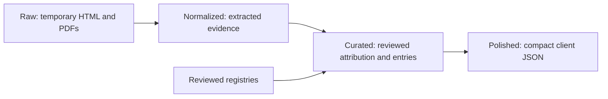

# Research pipeline



Collection and client builds are separate. Curating and polishing make no network
calls and never read `raw/`. The existing `published/` directory is the **polished
stage**; its name stays compatible with both Go services and the finder.

| Stage | Location | Purpose and retention |
| --- | --- | --- |
| Raw | Temporary directory with `--ephemeral-raw`; otherwise `storage/raw/` | HTML/PDF download cache. Optional; no deployment dependency. |
| Normalized | `storage/normalized/<election-id>/` and `storage/normalized/platforms/<election-id>/` | Parsed voting entries, disclosure page text, platform text, identity leads and collection errors. Keep on the research machine while review is pending. |
| Reviewed inputs | `storage/curated/identities.json`, `interests.json`, `platform-sources.json`, optional `platform-commitments.json` | Explicit source aliases, office history, dated interests, source seeds and reviewed commitments. Local review decisions, ignored by Git. |
| Curated snapshots | `storage/curated/datasets/` | Reconciled district and platform records. No raw bytes, extracted page bodies, cache paths, tasks or identity leads. Keep to regenerate client files without collecting again. |
| Polished | `storage/published/` | Compact JSON for serving. Includes facts, source links/hashes/retrieval dates and coverage limitations. Deploy this directory with the app; raw, normalized and curated storage are unnecessary on the server. |

All storage stages and the client's local content modules are ignored by Git.
Back up curated snapshots alongside the
reviewed inputs to preserve the ability to rebuild the retained client data.
Preserve normalized evidence if further review is planned. Source hashes identify
the downloaded version but cannot recreate it after the bytes are discarded.

## Collect and normalize

Run from `ingestion/`. These commands create normalized evidence without changing
the client data. Temporary downloads are cleaned up when each command exits,
including on errors; extraction results and diagnostics remain in normalized files.

```sh
python3 -m election --ephemeral-raw normalize
python3 run_candidate_records.py --ephemeral-raw
python3 run_platform_collection.py --ephemeral-raw
```

`normalize` defaults to every roster district; use `--district RCC` for a pilot.
The candidate-record collector downloads matching disclosure documents and
extracts their pages with Poppler `pdftotext`. Platform collection retains extracted
HTML/PDF text, not inferred campaign promises. Missing extraction, source errors,
name variants, and contradictory voting positions remain explicit review tasks.

For this machine's Python CA configuration, prefix online commands with
`SSL_CERT_FILE=/etc/ssl/cert.pem`. Do not disable TLS verification.

Omit `--ephemeral-raw` to retain/reuse a download cache. Use `--offline` for cached
collection or `--refresh` for new downloads. An ephemeral cache starts empty and
cannot be combined with offline mode. These options concern collection only;
downstream builds are always offline.

## Review and curate

Review normalized source excerpts and links, then update the reviewed inputs:

1. Confirm the candidate's identity, exact source aliases and prior-office sources
   in `identities.json`; set `reviewed_at` only after that review.
2. Record dated, page-linked interests in `interests.json`. A source document alone
   is not a reviewed holdings inventory, and a gift filing is not one either.
3. Optional platform commitments go in `platform-commitments.json`, keyed by the
   platform record's stable ID. Each entry requires `id`, `text`, `reviewed_at`,
   `document_id` pointing to a collected platform document, and `locator` identifying
   the page or section. This pipeline does not summarize or assess platforms.

```sh
python3 -m election curate
python3 -m election curate --district RCC
```

Exact name matches remain suggestions until the identity registry approves their
source aliases. Curating filters voting/disclosure attribution against the current
reviewed aliases, applies reviewed interests and commitments, validates references,
and writes portable snapshots. Revoking an identity review removes its attributed
records on the next build. Index-only votes remain labeled `index_only`; approving
identity attribution does not imply transcript or outcome review.

## Polish and serve

```sh
python3 -m election polish
python3 -m election polish --district RCC
python3 -m election validate --client storage/published/bc-provincial-2026/RCC.json
```

Polishing reads curated snapshots only, validates the whole selected batch before
writing, and atomically replaces individual client files. Validation failures leave
the previous client files intact. Writes are atomic per file, not one transaction
across the batch. Repeating a build with identical evidence/reviews produces
identical client bytes. Changes appear in the API without a service restart.

From the repository root, use `make data-build` to curate and polish existing
evidence, or `make data-curate` / `make data-polish` separately. The existing
`python3 -m election run --district RCC` remains a convenience command that runs
the district collection through all stages. Platform collectors now stop at
normalized; run `make data-build` afterward to produce their polished outputs.

`finder.json` is an independently collected client artifact in `published/`;
research builds leave it intact. Platform output is served by
`/api/platforms/parties` and `/api/platforms/candidates?district=RCC`; the client
data hook loads those records without changing presentation.

## Existing-data migration

Older platform collectors placed page text in `published/platforms/`. Move that
evidence through the new stages once:

```sh
python3 -m election migrate-evidence
python3 -m election build-data
```

Migration copies legacy page-bearing research to normalized storage and preserves
newer normalized evidence. Existing district and candidate-record evidence already
occupies normalized storage. After migration, polished outputs have no full page
text. Raw snapshots can then be deleted after validating the retained evidence and
polished output. Later client builds do not require them; later collection must
download sources again or use temporary downloads. Offline collection requires a
cache, while offline curating and polishing do not.

## Candidate political profiles

Political evidence now has its own pipeline under
`normalized/political/<election-id>/`, `curated/datasets/political/<election-id>/`
and `published/political/<election-id>/`. Every collected candidate gets a
profile, including candidates with no voting-index match. Party policy evidence
is stored once and referenced by `party_platform_id`.

```sh
# Candidate records and platform sources must already have been collected.
SSL_CERT_FILE=/etc/ssl/cert.pem python3 -m election collect-political-records --workers 4
# Rebuild/reclassify retained evidence without downloads:
python3 -m election build-political-profiles
# Subsequent ordinary builds include these profiles:
python3 -m election build-data
```

`collect-political-records` fetches each distinct Assembly sitting-day transcript
referenced by candidate voting indexes once. It retains normalized paragraph,
speaker and timestamp evidence, and resumes from successful normalized downloads.
`--refresh` refetches; `--offline` uses retained evidence/cache; `--ephemeral-raw`
discards downloads while retaining extracted transcript evidence. Unsupported
responses and fetch failures are recorded in `transcript-audit.json` and
`.attempt.json` files, preserving earlier successful evidence. Parser-version
changes reparse available raw snapshots. Collection failures produce a nonzero
exit status; the full diagnostics remain in `summary.json`.

Profiles contain:

- **Actions:** source-linked voting-index entries enriched with nearby transcript
  evidence, plus explicit first-person motions, amendment motions and bill
  introductions from those sitting days. Index question/outcome fields remain
  unchanged; suggested extracted questions, outcomes and tallies live separately
  in `transcript_context`. Multiple divisions, missing anchors and duplicate
  ambiguous anchors remain unresolved. All transcript extraction needs review.
- **Policy passages:** verbatim topic-bearing source lines and explicit promise
  language with page/line locators and adjacent context. These are unreviewed
  leads, not verified commitments. Passage dates are unknown until reviewed;
  retrieved dates do not establish when a promise was made. Navigation,
  biographies, third-party questionnaires and historical policy pages can still
  produce leads needing rejection. Explicit reviewed commitments continue to
  come from `curated/platform-commitments.json`.
- **Topic groups:** many-to-many action and candidate/party passage references.
  Suggested keyword classifications cover housing, healthcare, education,
  economy/taxation, environment/energy, public safety/justice, transportation,
  Indigenous relations, government/democracy and social policy/rights, with an
  `uncategorized` fallback. Matched keywords and method version are retained.
- **Comparisons:** reserved separately and empty. A shared topic does not imply
  support, contradiction, causation or fulfillment. Party commitments are not
  represented as personal promises.
- **Coverage:** identity review, index matches, context counts, collection errors,
  known prior offices and explicit gaps. Municipal/council voting, committees and
  sitting days without collected voting entries require additional adapters.

Full-name index matches and shortened Hansard speaker matches remain private
attribution leads. Public profiles contain voting actions only where the reviewed
identity registry explicitly permits the member alias. Shortened speaker matches
remain private even when the candidate identity is reviewed. Topic references are
filtered accordingly. Revoking identity review removes those actions on the next
build. Public coverage counts describe research evidence; `published_action_count`
reports the subset actually included in the profile.

`build-political-profiles` validates profiles before replacing curated snapshots;
polishing validates the selected political batch before replacing its files.
Publication is atomic per file. Rebuilding identical evidence produces identical
profile bytes. The outputs are ready for a future site/API presentation, but this
change does not expose a new endpoint or change the UI. Generated research remains
Git-ignored: back up normalized evidence and reviewed inputs.

## Decision interpretation and candidate issue patterns

The optional LLM analysis service in `election/analysis/` interprets shared
decisions once, validates cited evidence and derives candidate issue patterns
locally. It supports DeepSeek and other OpenAI-compatible chat endpoints.
See [analysis configuration, usage, evidence rules and storage](ANALYSIS.md).

```sh
python3 -m election estimate-political-analysis
python3 -m election analyze-political-records --district RCC --max-calls 12
python3 -m election --offline analyze-political-records
```

Model results stay separate from source facts and retain
`machine_generated_needs_review` status. Current public findings can be embedded
in polished candidate profiles as `issue_analysis`. Ordinary profile builds use
existing analysis only, never call a model, and discard stale findings when
source evidence or reviewed candidate attribution changes.
